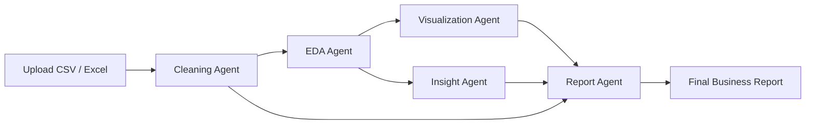

<div align="center">


# Auto-Data-Analyst

<p>
  <em>Upload a dataset, let specialized AI agents clean it, analyze it, visualize it, extract insights, and assemble a polished business report.</em>
</p>

<p>
  
  
  
  
  
</p>

<p>
  
</p>

</div>

***

## Overview

**Auto-Data-Analyst** is an end-to-end analytical assistant that turns uploaded datasets into structured outputs such as cleaned data, exploratory analysis, visualizations, business insights, and downloadable reports. Instead of treating analysis as one prompt, the project separates the workflow into dedicated agents so each stage has a clear responsibility and produces a more understandable final result.

This project is designed for students, analysts, founders, and operations teams who need a fast first-pass analysis without manually stitching together notebooks, charts, summaries, and slide-ready observations. The result is a practical interface where raw spreadsheet-like data can quickly become something useful for discussion and decision-making.

## Why this project matters

Most early-stage analysis work is repetitive: inspect the file, fix missing values, normalize columns, look for outliers, generate charts, summarize patterns, and then rewrite the findings into business language. This repository compresses that repetitive workflow into one guided application flow.

The value is not only speed. The bigger benefit is **consistency**: the same pipeline performs cleaning, descriptive analysis, correlation checks, chart generation, insight extraction, and report writing in a repeatable order, which makes the output easier to review, improve, and present.

## Core workflow



The application starts by loading a user dataset and preparing it for analysis. After that, separate agents handle statistical exploration, chart generation, insight extraction, and final narrative reporting.

This architecture keeps the system modular. Each agent focuses on one problem, which makes the project easier to maintain, debug, and extend with new analytical capabilities later.

## Multi-agent architecture

### 1. Cleaning Agent
The cleaning agent loads the input file, removes duplicate rows, attempts to convert date and time columns, fills missing numeric values with medians, fills categorical gaps with mode or fallback values, and standardizes column names into snake_case.

Its output is not just a transformed dataframe. It also creates a readable cleaning report so users can understand what changed and why the preprocessing step matters before any analysis begins.

### 2. EDA Agent
The EDA agent computes descriptive statistics, skewness, outlier information, and correlation signals using helper utilities. It then packages those numeric findings into an AI-generated exploratory summary that highlights patterns, anomalies, and relationships across columns.

This step acts like the technical analyst of the system. It translates raw statistical signals into a narrative that a non-technical user can still follow.

### 3. Visualization Agent
The visualization layer generates charts from the cleaned data so trends and comparisons are easier to interpret visually. This reduces the friction of going from tables to presentation-ready outputs and makes the project useful beyond purely textual summaries.

Because visualization is isolated from cleaning and insight generation, it becomes easier to swap chart strategies, add new templates, or support richer reporting formats later.

### 4. Insight Agent
The insight agent takes the dataset sample, column structure, EDA summary, and statistical context, then turns them into actionable business observations. Instead of stopping at “what the data says,” it pushes toward “what a team should notice or do next.”

That makes the project more than a descriptive analytics tool. It becomes a bridge between data processing and decision support.

### 5. Report Agent
The report agent combines the cleaning notes, EDA findings, business insights, and visual outputs into a polished final narrative. This is especially useful for demos, stakeholder updates, classroom presentations, and quick internal reporting.

In practice, this final layer is what makes the application feel complete. Users do not just receive fragments of analysis; they receive a connected story.

## Project structure

```bash
Auto-Data-Analyst/
├── agents/
│   ├── cleaning_agent.py
│   ├── eda_agent.py
│   ├── insight_agent.py
│   ├── llm_fallback.py
│   ├── report_agent.py
│   └── visualization_agent.py
├── tools/
│   ├── chart_generator.py
│   └── pandas_tools.py
├── .streamlit/
│   └── config.toml
├── app.py
├── main.py
├── requirements.txt
├── Dockerfile
├── app.yaml
├── cloudbuild.yaml
├── deploy-gcp.sh
└── render.yaml
```

The structure reflects a clear separation of concerns. Agents own reasoning-heavy stages, while the `tools/` directory contains reusable utility functions for file loading, statistics, chart creation, and dataframe operations.

That separation is a strong design choice for future scaling. New capabilities such as forecasting, anomaly scoring, SQL export, or natural-language Q&A can be added without rewriting the entire application.

## Key features

- Automated data cleaning pipeline for CSV and spreadsheet-style datasets.
- Exploratory data analysis with descriptive statistics, skewness, outlier detection, and correlation checks.
- Business-oriented insight generation from technical analysis outputs.
- Visualization support for turning tabular data into readable charts.
- Final reporting flow that consolidates multiple analysis stages into one deliverable.
- LLM fallback handling for rate-limit scenarios, which improves resilience in real-world usage.
- Deployment-ready setup for local development, Docker, Render, and Google Cloud.

## Technical highlights

### Data processing foundation
The project leans on Pandas and NumPy for dataframe transformation and numeric inspection. That gives the app a dependable analytical core before any language-model reasoning is applied.

This is important because the strongest AI data apps do not rely on text generation alone. They combine deterministic data operations with model-based interpretation, and this repository follows that pattern well.

### LLM orchestration and fallback
The agent layer uses CrewAI-style task orchestration and a Groq-backed LLM path for natural-language summarization, analysis, and reporting. A dedicated fallback utility detects rate-limit style failures and converts them into reusable user-facing messages.

That is a thoughtful reliability feature. Many AI demos fail silently or crash on quota issues, but this codebase explicitly handles that operational edge case.

### Deployment readiness
The repository includes `Dockerfile`, `render.yaml`, `app.yaml`, `cloudbuild.yaml`, and a deployment shell script, which shows the project is prepared not only as a prototype but as a deployable application.

That makes it easier for recruiters, collaborators, or hackathon judges to see this as a product-minded project rather than just an experiment.

## How it works

1. A user uploads a dataset.
2. The cleaning agent preprocesses and standardizes the data.
3. The EDA agent computes summary statistics, outliers, skewness, and correlations.
4. The visualization layer creates charts for easier interpretation.
5. The insight agent converts analytical findings into actionable observations.
6. The report agent merges everything into a final business-style output.

This sequence mirrors how a real analyst often works, but in a more automated and reproducible form.

## Installation

```bash
git clone https://github.com/shiv9918/Auto-Data-Analyst.git
cd Auto-Data-Analyst
pip install -r requirements.txt
```

Create your environment file:

```bash
cp .env.example .env
```

Then add the required keys in `.env`:

```env
GROQ_API_KEY=your_api_key_here
```

## Run locally

```bash
streamlit run app.py
```

If your entry path uses `main.py` in your deployment flow, make sure your hosting configuration matches the correct startup file.

## Example use cases

- Sales dataset review for quick trend and performance analysis.
- Startup KPI inspection before an investor or team update.
- Academic mini-projects where raw CSV files need fast cleaning and interpretation.
- Operations dashboards where teams need anomaly and outlier summaries.
- Business reporting demos for portfolios, hackathons, and interviews.

## What makes it stand out

Most beginner data apps stop after plotting a few charts or printing `.describe()`. This project goes further by chaining preprocessing, statistical inspection, visualization, business interpretation, and reporting into one user-facing flow.

That end-to-end framing is what gives the project portfolio strength. It shows not only data handling, but also workflow design, modular engineering, AI integration, resilience handling, and deployment awareness.

## Ideas for next upgrades

- Add dataset-specific chart recommendations based on column types.
- Support PDF, DOCX, or slide export for reports.
- Add conversational Q&A over uploaded datasets.
- Add anomaly scoring and forecasting modules.
- Persist analysis sessions for multi-step review.
- Introduce user-selectable report tones such as executive, technical, or academic.
- Add benchmark datasets and screenshots in the repository for easier onboarding.

## README animation notes

This README intentionally uses animated banner and typing effects through external SVG renderers that GitHub supports in Markdown image tags. It keeps the page visually premium without requiring JavaScript, which GitHub README files do not execute.

For an even richer profile-style presentation, you can later add contribution-style stat cards, workflow icons, demo GIFs, and linked screenshots inside a `/assets` folder.

## Suggested repository additions

To make this README even stronger in public view, add these assets to the repository:

- `assets/demo.gif` for a quick upload-to-report walkthrough.
- `assets/architecture.png` for a custom system diagram.
- `assets/screenshots/` for dashboard, charts, and report previews.
- A filled `README.md` that mirrors this premium version.

## Author focus

This project demonstrates practical strength in Python application development, modular AI agent design, data analysis workflows, and deployment packaging. It reads well as a portfolio project because it connects technical implementation to a real business use case.

If positioned in a portfolio, it can be described as an AI-powered multi-agent analytics assistant that automates the journey from raw datasets to business-ready insights.

***

<div align="center">
  <sub>Built to transform raw data into clear decisions.</sub>
</div>
