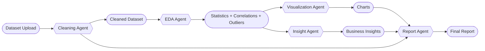

<div align="center">


<br/>


<br/>


<br/><br/>


</div>

***

## Project Vision

**Auto-Data-Analyst** is an intelligent data analysis application that transforms raw datasets into cleaned tables, statistical summaries, visual dashboards, business insights, and final reports. It is built as a multi-agent workflow so each stage of the pipeline behaves like a focused specialist instead of forcing one large block of logic to do everything.

This makes the project attractive for academic submission because it demonstrates both engineering structure and practical problem solving. Rather than showing isolated scripts, it presents a complete analytical system with user interaction, automated processing, AI-generated interpretation, and report-ready output.

<div align="center">
  
</div>

## Why this project stands out

Many student projects stop at loading a CSV and printing simple charts. **Auto-Data-Analyst** goes further by automating the full analysis lifecycle: preprocessing, exploratory analysis, chart generation, insight extraction, and business-style report creation.

That full-stack analytical flow makes the project look polished and serious. It shows skill in Python development, data handling, modular architecture, AI integration, error handling, and deployment configuration in one repository.

## Animated workflow

<div align="center">



</div>

The workflow is intentionally modular. A dataset first enters the cleaning stage, then passes into exploratory analysis, visualization, insight generation, and final reporting so the output becomes both technically meaningful and presentation ready.

This sequence also mirrors how real analysts work. The project therefore feels closer to an actual product workflow than a simple demo notebook.

## System architecture

### Cleaning Agent
The cleaning agent prepares the dataset before deeper analysis begins. It removes duplicate rows, detects date and time columns, fills missing numeric values with median values, fills categorical gaps with mode or fallback values, and normalizes column names into snake_case.

That preprocessing layer is important because downstream analysis is only as good as the quality of the input. By creating a readable cleaning report alongside the transformed dataframe, the project keeps the workflow transparent instead of silently modifying data.

### EDA Agent
The exploratory data analysis agent computes descriptive statistics, skewness, outlier signals, and correlations using utility functions from the tools layer. It then turns those outputs into a more readable narrative summary through the LLM pipeline.

This combination of numeric analysis and AI explanation is one of the strongest parts of the project. It helps technical results become understandable for users who may not want to read raw statistical output.

### Visualization Agent
The visualization agent converts processed data into charts so patterns, comparisons, and anomalies become easier to interpret at a glance. This gives the app stronger presentation value because visual summaries are often the most effective way to communicate data findings.

Separating visualization into its own module is also a strong design choice. It keeps the charting logic reusable and makes the overall pipeline easier to extend or maintain.

### Insight Agent
The insight agent shifts the project from descriptive analytics to decision-oriented analysis. It uses dataset columns, example rows, EDA results, and summary context to generate actionable business insights rather than stopping at technical observations.

This is what makes the application feel smarter than a standard dashboard. It does not only describe data; it interprets what the data may mean for a team, product, or business scenario.

### Report Agent
The report agent consolidates cleaning notes, analytical findings, insights, and visuals into a polished final report. That final packaging layer makes the project suitable for submission, demos, presentations, and stakeholder-facing outputs.

In portfolio terms, this is powerful because it shows end-to-end thinking. The user does not receive disconnected analysis fragments; they receive a complete analytical narrative.

## Feature highlights

<div align="center">

| Capability | What it does |
|---|---|
| Automated cleaning | Removes duplicates, handles missing values, standardizes columns |
| Exploratory analysis | Computes descriptive statistics, skewness, outliers, and correlations |
| AI summarization | Converts technical findings into readable explanations |
| Visualization | Produces chart-based interpretation from structured data |
| Business insights | Generates actionable observations from analytical outputs |
| Final reporting | Combines analysis stages into one polished output |
| Rate-limit resilience | Detects LLM limit issues and returns controlled fallback messaging |
| Deployment support | Includes Docker, Render, and Google Cloud configuration |

</div>

## Project structure

```bash
Auto-Data-Analyst/
├── agents/
│   ├── cleaning_agent.py
│   ├── eda_agent.py
│   ├── insight_agent.py
│   ├── llm_fallback.py
│   ├── report_agent.py
│   └── visualization_agent.py
├── tools/
│   ├── chart_generator.py
│   └── pandas_tools.py
├── .streamlit/
│   └── config.toml
├── app.py
├── main.py
├── requirements.txt
├── Dockerfile
├── render.yaml
├── app.yaml
├── cloudbuild.yaml
└── deploy-gcp.sh
```

The structure clearly separates orchestration, data utilities, UI logic, and deployment setup. That is a strong architectural signal for evaluators because it shows this repository was designed as an application, not just assembled as a collection of scripts.

## Technical depth

### Streamlit interface
The application uses Streamlit as the front-end layer, giving users a simple way to upload data and interact with outputs. The UI code also includes dataset-aware examples, dashboard rendering, provider labels, and code-safety checks for generated pandas operations.

### Pipeline orchestration
The `main.py` pipeline coordinates the full run from cleaning to reporting. It saves cleaned data, triggers EDA, generates visualizations, produces insights, and then assembles the final report in sequence.

### LLM fallback handling
The `llm_fallback.py` module adds operational maturity to the project by catching rate-limit style failures and converting them into structured retry messages. That improves reliability and makes the application more professional than a typical classroom AI project.

### Report generation
The reporting layer uses PDF generation to turn analytical output into a formal artifact. This makes the system more useful in real presentation contexts because results are not limited to on-screen text.

## Execution flow

```text
Upload file
   ↓
Clean and standardize dataset
   ↓
Run EDA and compute statistical signals
   ↓
Generate charts and visual summaries
   ↓
Extract business-oriented insights
   ↓
Assemble final report
```

This flow is simple to understand and visually strong for project review. It clearly communicates that the system is designed to turn raw input into polished output with minimal manual intervention.

## Installation

```bash
git clone https://github.com/shiv9918/Auto-Data-Analyst.git
cd Auto-Data-Analyst
pip install -r requirements.txt
cp .env.example .env
```

Add your API key in the `.env` file:

```env
GROQ_API_KEY=your_api_key_here
```

## Run the project

```bash
streamlit run app.py
```

## Submission-ready pitch

**Auto-Data-Analyst** is a multi-agent AI-powered analytical application that automates the journey from raw datasets to cleaned data, exploratory analysis, visual insights, business recommendations, and final reporting. It combines Python, Streamlit, Pandas, CrewAI-style agent orchestration, Groq-based LLM processing, and deployment-ready packaging into one complete end-to-end data project.

## Attractive closing section

<div align="center">

### Smart Data. Clean Analysis. Better Decisions.


</div>
